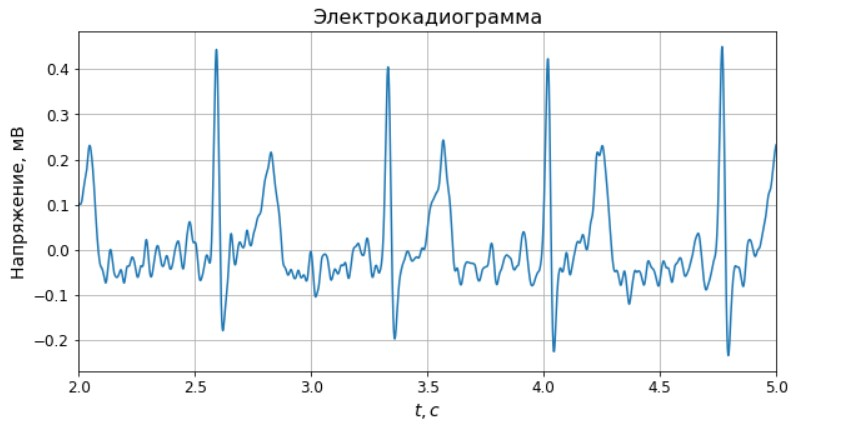
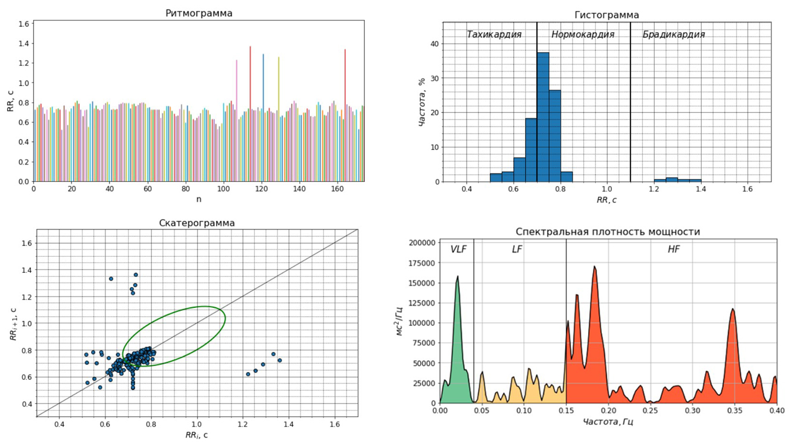
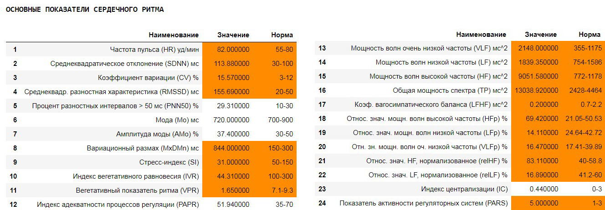
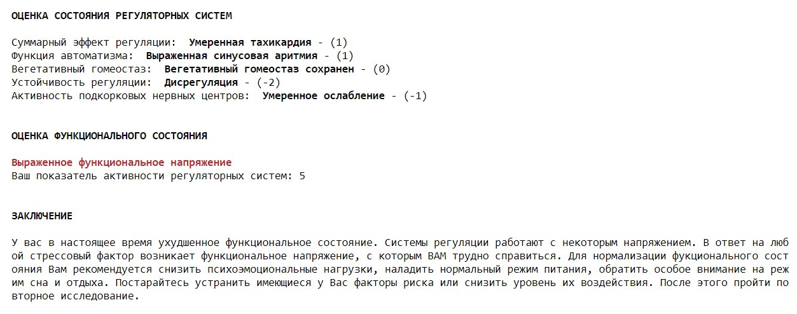

# Оценка функционального состояния человека на основе анализа вариабельности сердечного ритма

Программа представляет собой часть аппаратно-программного комплекса для проверки функционального состояния человека на основе вариабельности сердечного ритма. Для проверки работоспособности использовались ЭКГ-сигналы, снятые со студентов с помощью аппаратной части диагностического комплекса.

**Ключевая идея** - величина между следующими друг за другом сердечными циклами и закономерности в их изменчивости (вариабельность сердечного ритма) позволяют судить о состоянии систем, регулирующих работу всего организма.

# Особенности
- На входе алгоритма сырой сигнал ЭКГ
- Выделение RR-интервалов с помощью алгоритма Пана-Томпкинса
- На выходе алгоритма заключение о функциональном состоянии человека

# Ресурсы
**Python Version:** 3.6.8

**Packages:** pandas, numpy, scipy, matplotlib

# Результат работы
**_Отфильтрованный сигнал_**

**_Графический анализ_**

**_Таблица показателей_**

**_Заключение_**

